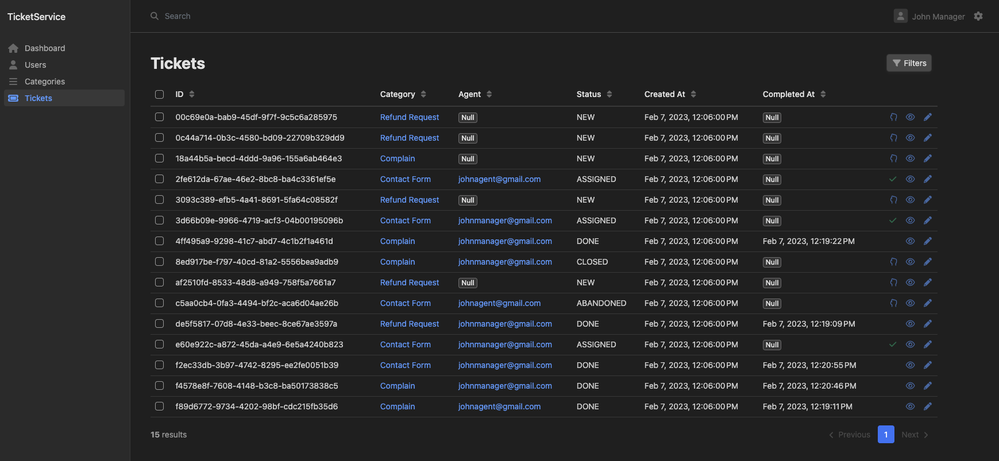
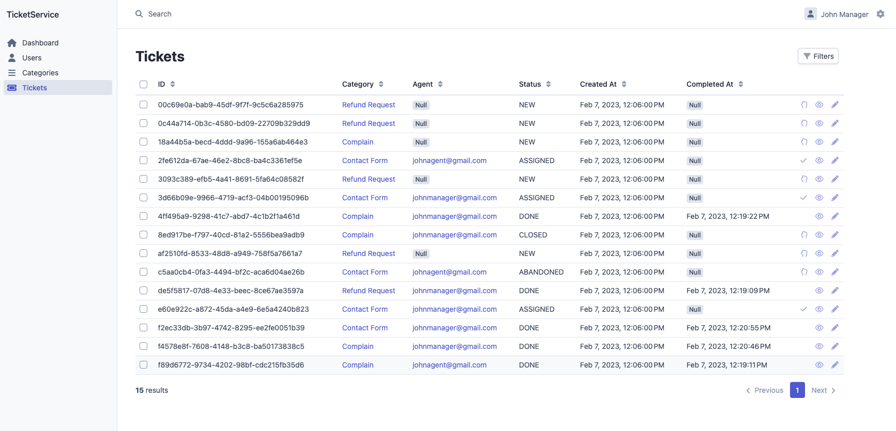
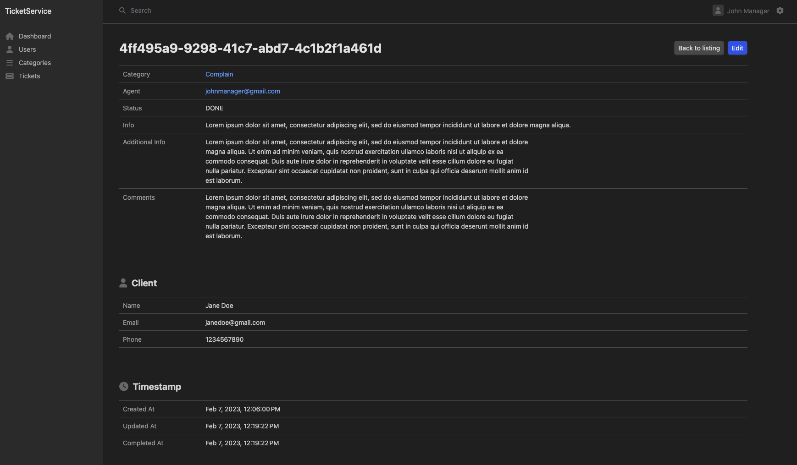
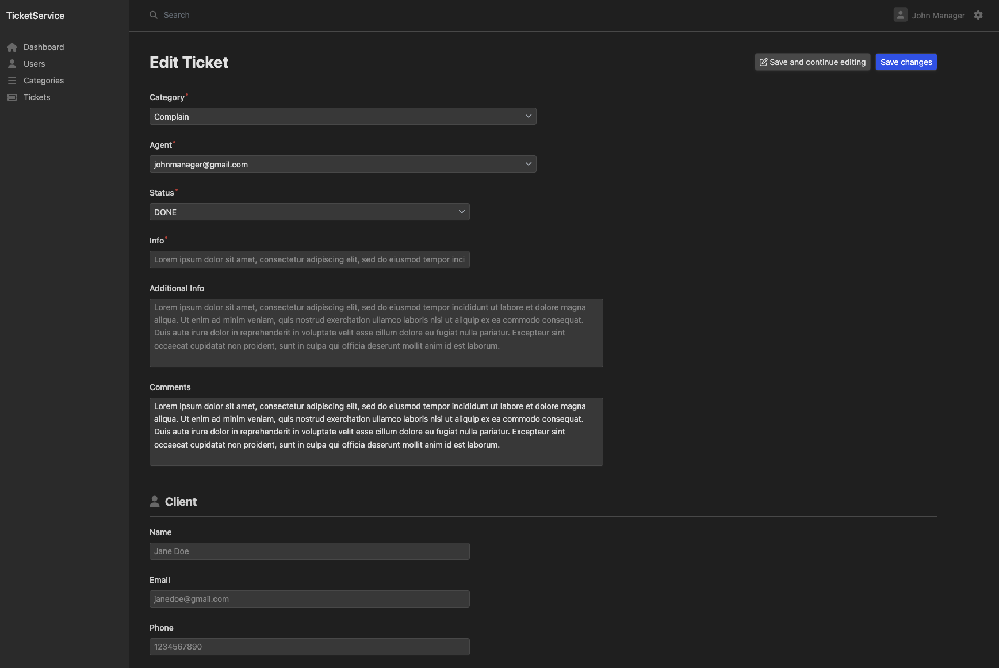

# TicketService

## How it works?

Ticket service allows you to store and manage "Contact Us", "Complain" and other get in touch forms you
have in your app. The service provides a single api method which creates a new ticket from your clients.
You can access all the tickets by an admin dashboard, assign them to your agents and watch for statuses.
Create any category like "Contact Us", "Complain", "Refund Request" and filter them for easy access.

## Info

[PHP8.2](https://www.php.net/releases/8.2/en.php) |
[Symfony 6](https://symfony.com) |
[EasyAdminBundle](https://symfony.com/bundles/EasyAdminBundle/current/index.html)

## Admin Dashboard

#### Ticket list view in dark mode



#### Ticket list view in light mode



#### Ticket details view



#### Ticket form view



### Installation

```bash
make install
make migrate
```

### Create a user

```bash
make ssh
php bin/console app:create-user
```

### Tests

```bash
make test
```

### API

POST /api/v1/tickets

```json
{
  "category": "refund-request",
  "info": "I want to apply for a refund",
  "clientName": "John Doe",
  "clientEmail": "johndoe@gmail.com",
  "clientPhone": "1234567890",
  "additionalInfo": "So the problem is..."
}
```

Response 200

```json
{
  "id": "e938541f-865b-487d-a76d-088408e9e30e"
}
```

License
-------

This software is published under the [MIT License](LICENSE.md)

[1]: https://github.com/amvid/ticket-service/tree/main/LICENSE.md
